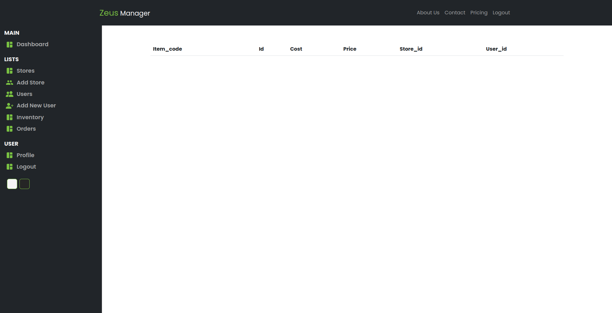

# Flask React Test Project

## Description

This app is a React application with a flask API includes JWT authentication, authorization, Redux toolkit Redux React Query for state management. The task was to create an application that uses JWT authentication, and authorization for multiple users with limited crud operations and admin users reserving all functionally including creating new users and unlimited crud operations on all models in the database.

## Table of Contents

- [Technologies](#technologies)
- [Instructions](#how-to-use)
- [Screenshots](#screenshots)

---

## Technologies

- Javascript
- React
- Redux Toolkit
- Redux React Query
- Flask
- JWT

---

## How To Use

#### Installation

Clone or download this repository.

To install the server side/Flask of the project cd into the project directory server create a python environment install requirements.txt and run the api.py file which should run on [http://localhost:5000].

To install the client side/React of the project cd into the client directory run npm install to download all package.json dependencies then run npm start to run the project the should start on [http://localhost:3000].

### Please Note!!! always run the Flask API first before running the React app, and only admin users can create new users login as an admin user.

---

## Screenshots

> Login
> 

> Dashboard
> 

> Add A New User
> 

> Users Table
> 

> Update User
> 

> Add A New Store
> 

> Stores Table
> 

> update Store
> 

> Inventory Table
> 

## Author Info

- linkedin - [@gauta-ncholo](https://www.linkedin.com/in/gauta-ncholo/)
- Website - [Gauta Ncholo Portfolio](https://therealblackgold.github.io/Gauta-Ncholo-Resume/)
